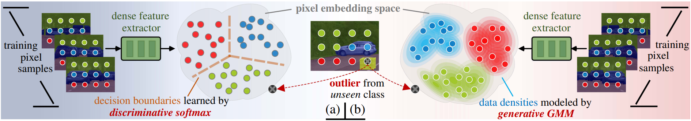

# GMMSeg



> This repository is an official PyTorch implementation of paper:<br>
> [GMMSeg: Gaussian Mixture based Generative Semantic Segmentation Models](https://arxiv.org/abs/2210.02025).<br>
> [Chen Liang](https://leonnnop.github.io/), [Wenguan Wang](https://sites.google.com/view/wenguanwang/), [Jiaxu Miao](https://scholar.google.com/citations?user=kQ-FWd8AAAAJ&hl=en), [Yi Yang](https://scholar.google.com/citations?user=RMSuNFwAAAAJ&hl=zh-CN) <br>
> NeurIPS 2022 (Spotlight). ([arXiv 2210.02025](https://arxiv.org/abs/2210.02025))

## News
- [2022-12-24] Release the code based on [MMSegmentation v0.22.1](https://github.com/open-mmlab/mmsegmentation/tree/v0.22.1).
- [2022-10-12] Repo created. Code will come soon. Stay tuned.

## Abstract
Prevalent semantic segmentation solutions are, in essence, a dense discriminative classifier of p(*class*|*pixel feature*). Though straightforward, this de facto paradigm neglects the underlying data distribution p(*pixel feature*|*class*), and struggles to identify out-of-distribution data. Going beyond this, we propose GMMSeg, a new family of segmentation models that rely on a dense generative classifier for the joint distribution p(*pixel feature*,*class*). For each class, GMMSeg builds Gaussian Mixture Models (GMMs) via Expectation-Maximization (EM), so as to capture class-conditional densities. Meanwhile, the deep dense representation is end-to-end trained in a discriminative manner, *i.e.*, maximizing p(*class*|*pixel feature*). This endows GMMSeg with the strengths of both generative and discriminative models. With a variety of segmentation architectures and backbones, GMMSeg outperforms the discriminative counterparts on three closed-set datasets. More impressively, without any modification, GMMSeg even performs well on open-world datasets. We believe this work brings fundamental insights into the related fields.

## Installation
This implementation is built on [MMSegmentation v0.22.1](https://github.com/open-mmlab/mmsegmentation/tree/v0.22.1). Many thanks to the contributors for their great efforts.

Please follow the [get_started](https://github.com/open-mmlab/mmsegmentation/blob/master/docs/en/get_started.md#installation) for installation and [dataset_prepare](https://github.com/open-mmlab/mmsegmentation/blob/master/docs/en/dataset_prepare.md#prepare-datasets) for dataset preparation.

Other requirements: `pip install timm==0.5.4 einops==0.4.1`

## Performance
| Backbone  | Model      | Train Set | Val Set | Iterations | Batch Size | mIoU  | Log | CKPT | Config |
| --------- | ---------- | --------- | ------- | ---------- | ---------- | ----- | --- | ----   | ----   |
| MiT-B5 | GMMSeg-Segformer |coco-stuff10k-train     |coco-stuff10k-test     | 80000      | 8xbs2          | 44.81 | [log](https://github.com/leonnnop/release-weights/releases/download/v.neurips22/20221029_173957.log) | [ckpt](https://github.com/leonnnop/release-weights/releases/download/v.neurips22/GMMSeg-Segformer-b5-512x512-80k-cocostuff10k.pth) | [cfg](https://github.com/leonnnop/release-weights/releases/download/v.neurips22/segformer_mit-b5_gmmseg_512x512_80k_cocostuff10k.py) |

## Usage
```shell
# single-gpu train
python tools/train.py configs/_gmmseg/segformer_mit-b5_gmmseg_512x512_80k_cocostuff10k.py 

# multi-gpu train
bash ./tools/dist_train.sh configs/_gmmseg/segformer_mit-b5_gmmseg_512x512_80k_cocostuff10k.py ${GPU_NUM}

# single-gpu test
python tools/test.py configs/_gmmseg/segformer_mit-b5_gmmseg_512x512_80k_cocostuff10k.py /path/to/checkpoint_file

# multi-gpu test
bash ./tools/dist_test.sh configs/_gmmseg/segformer_mit-b5_gmmseg_512x512_80k_cocostuff10k.py /path/to/checkpoint_file ${GPU_NUM}
```
Note: We recommend training with eight Tesla A100 GPUs, *i.e.*, `GPU_NUM=8`.

Please also see [train](https://github.com/open-mmlab/mmsegmentation/blob/master/docs/en/train.md) and [inference](https://github.com/open-mmlab/mmsegmentation/blob/master/docs/en/inference.md) for the detailed usage of MMSegmentation.

## Relevant Projects

May also see a series of our related works in visual recognition: 

[1] Exploring Cross-Image Pixel Contrast for Semantic Segmentation - ICCV 2021 (Oral) [[arXiv](https://arxiv.org/abs/2101.11939)][[code](https://github.com/tfzhou/ContrastiveSeg)]

[2] Rethinking Semantic Segmentation: A Prototype View - CVPR 2022 (Oral) [[arXiv](https://arxiv.org/abs/2203.15102)][[code](https://github.com/tfzhou/ProtoSeg)]

[3] Deep Hierarchical Semantic Segmentation - CVPR 2022 [[arXiv](https://arxiv.org/abs/2203.14335)][[code](https://github.com/lingorX/HieraSeg)]

[4] Visual Recognition with Deep Nearest Centroids - arXiv 2022 [[arXiv](https://arxiv.org/abs/2209.07383)][[code](https://github.com/ChengHan111/DNC)]

## Citation

If you find GMMSeg useful or inspiring, please consider citing our paper:

```bibtex
@article{liang2022gmmseg,
  title    = {GMMSeg: Gaussian Mixture based Generative Semantic Segmentation Models},
  author   = {Liang, Chen and Wang, Wenguan and Miao, Jiaxu and Yang, Yi},
  journal  = {Advances in Neural Information Processing Systems},
  year     = {2022}
}
```

## Contact

This repository is currently maintained by [Chen Liang](mailto:leonnnop@gmail.com).